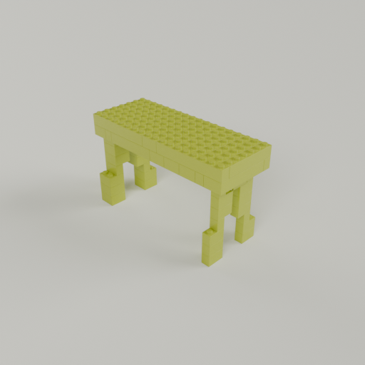

# LegoGPT

## Installation

### Prerequisites

Running stability analysis requires a [Gurobi licence](https://www.gurobi.com/downloads/) to use Gurobi. Academics may
request a free licence from the Gurobi website [here](https://www.gurobi.com/academia/academic-program-and-licenses/).

### Installing as a standalone project

This repo uses the Python project manager uv. To install this repo as a standalone project:

1. Clone the repo: `git clone "git@github.com:AvaLovelace1/LegoGPT.git" && cd LegoGPT`.
2. Install the following dependencies required for rendering LEGO visualizations:
    - Install the ImportLDraw submodule with `git submodule init && git submodule update`.
    - Some files in the ImportLDraw submodule are stored using the Git LFS system. To download these files,
      install [Git LFS](https://git-lfs.com), `cd` into the ImportLDraw directory, and run
      `git lfs pull`.
    - Download the LDraw parts library `complete.zip` from [here](https://library.ldraw.org/updates?latest), and
      extract it in your *home directory*.
3. Finally, [install uv](https://docs.astral.sh/uv/getting-started/installation/). A virtual environment will be
   created, and the remaining dependencies installed automatically, upon invoking `uv run [SCRIPT_NAME]`.

### Installing as a package

To install this repo as a package in your own Python project, run

```zsh
uv add "git+ssh://git@github.com/AvaLovelace1/LegoGPT.git"
```

if using uv, or

```zsh
pip install "git+ssh://git@github.com/AvaLovelace1/LegoGPT.git"
```

if using pip.

## Running inference interactively

You can run inference with the fine-tuned LegoGPT model using:

```zsh
uv run infer --model_name_or_path MODEL_PATH
```

This script starts an interactive session where you can input a prompt and get a response from the model. See
`uv run infer -h` for a full list of options.

### Example interaction

Here is an example interaction using the `infer` script:

```zsh
uv run infer --model_name_or_path '/data/apun/finetuned_hf/LegoGPT'
```

```text
Enter a prompt, or <Return> to exit: Table featuring a flat rectangular surface over four evenly spaced legs.
Enter a filename to save the output image (default=output.png): output.png
Enter a generation seed (default=42): 42
Generating...
Set parameter Username
Academic license - for non-commercial use only - expires 2026-02-19
--------------------
Finished generating in 63.53s.
Total # bricks: 59
Total # brick rejections: 98
Brick rejection reasons: {'collision': 5, 'already_rejected': 93}
Total # regenerations: 4
Saved results to /home/apun/LegoGPT/output.txt, /home/apun/LegoGPT/output.ldr, and /home/apun/LegoGPT/output.png
--------------------
Enter another prompt, or <Return> to exit:
```

`output.png` contains a rendered image of the generated LEGO structure:



`output.txt` contains the LEGO structure in brick-by-brick text format:

```text
1x2 (16,18,0)
1x2 (16,13,0)
2x2 (0,18,0)
2x2 (0,13,0)
1x2 (16,18,1)
[...]
```

`output.ldr` contains the LEGO structure in LDraw format, which can be opened with any LDraw-compatible software.

## Fine-tuning LegoGPT

We use Hugging Face [TRL](https://huggingface.co/docs/trl/index)
with [Accelerate](https://huggingface.co/docs/accelerate/index) for fine-tuning. To run fine-tuning, follow these
instructions:

1. Start with a LEGO dataset with the fields "caption" and "lego". The "caption" field should contain a description of
   the LEGO model, and the "lego" field should contain the corresponding LEGO model, in the text format described in the
   paper.
2. Prepare the dataset for finetuning with
   `uv run prepare_finetuning_dataset --input_path LEGO_DATASET_PATH --output_path FINETUNING_DATASET_PATH`.
3. Download the pretrained [Llama-3.2-1B-Instruct model](https://huggingface.co/meta-llama/Llama-3.2-1B-Instruct) to
   some directory `[PRETRAINED_DIR]`.
   **IMPORTANT:** Replace the `config.json`, `special_tokens_map.json`, and `tokenizer_config.json` files with the ones
   in the `finetuning_config_files` directory. This specifies the `pad_token` to be different from the `eos_token`,
   fixing a fine-tuning [issue](https://github.com/unslothai/unsloth/issues/416) where the model will not learn to
   output EOS tokens properly.
4. Initialize the Accelerate config file with `uv run accelerate config`.
5. Run finetuning with `uv run ./finetune.zsh [PRETRAINED_DIR] [OUTPUT_DIR] [RUN_NAME] [FINETUNING_DATASET_PATH]`. The
   finetuned model will be saved to `[OUTPUT_DIR]/[RUN_NAME]`.
